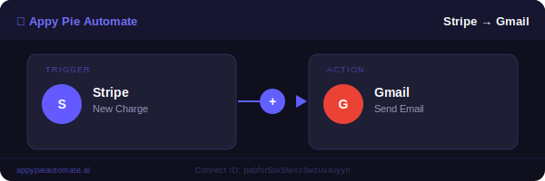
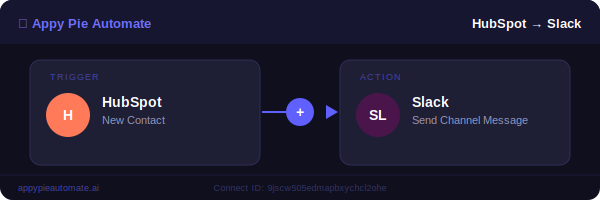
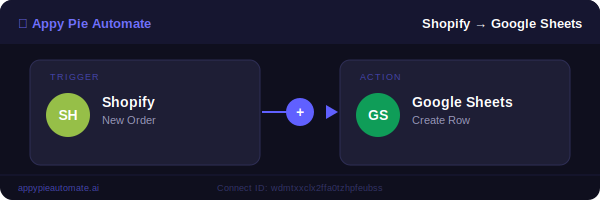
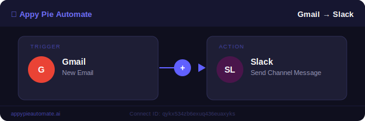

# Workflow Templates — Appy Pie Automate

> Ready-to-use automation workflows built on [Appy Pie Automate](https://appypieautomate.ai). Click any flow link below to open it directly in your Connect dashboard.

---

## 🔁 Live Workflow Templates

### 1. Stripe → Gmail · New Charge → Send Email

**Trigger:** Stripe — New Charge  
**Action:** Gmail — Send Email  
📎 [Open in Connect Dashboard](https://connectcloud.appypie.com/customeditor/69d60a7d74b1426bfd90f22e/overview/pabfsr5ox5lwxz3wzuv4uyyn)

> Automatically send a confirmation email via Gmail whenever a new charge is created in Stripe. Perfect for payment receipts and instant customer communication.

---

### 2. HubSpot → Slack · New Contact → Send Channel Message

**Trigger:** HubSpot — New Contact  
**Action:** Slack — Send Channel Message  
📎 [Open in Connect Dashboard](https://connectcloud.appypie.com/customeditor/69d60a7d74b1426bfd90f22e/overview/9jscw505edmapbxychcl2ohe)

> Alert your sales team in a Slack channel the moment a new contact is added to HubSpot. Never miss a fresh lead.

---

### 3. Shopify → Google Sheets · New Order → Create Spreadsheet Row

**Trigger:** Shopify — New Order  
**Action:** Google Sheets — Create Spreadsheet Row  
📎 [Open in Connect Dashboard](https://connectcloud.appypie.com/customeditor/69d60a7d74b1426bfd90f22e/overview/wdmtxxclx2ffa0tzhpfeubss)

> Log every new Shopify order as a row in Google Sheets automatically. Great for order tracking, reporting, and inventory management.

---

### 4. Gmail → Slack · New Email → Send Channel Message

**Trigger:** Gmail — New Email  
**Action:** Slack — Send Channel Message  
📎 [Open in Connect Dashboard](https://connectcloud.appypie.com/customeditor/69d60a7d74b1426bfd90f22e/overview/qykx534zb6exuq436euaxyks)

> Forward important Gmail messages to a Slack channel instantly. Keep your team notified of critical emails in real time.

---

## 📂 More Templates by Category

### 📧 Email Automation
| Trigger | Action | Use Case |
|---------|--------|----------|
| Gmail: New Email | Slack: Message | Email-to-Slack alerts |
| Stripe: New Charge | Gmail: Send Email | Payment confirmation emails |
| HubSpot: Form Submit | Mailchimp: Add Subscriber | Auto-subscribe leads |

### 🛒 E-Commerce
| Trigger | Action | Use Case |
|---------|--------|----------|
| Shopify: New Order | Google Sheets: New Row | Order logging |
| Shopify: New Order | Slack: Message | Team order alerts |
| WooCommerce: New Order | Gmail: Send Email | Order confirmations |

### 💬 Team Notifications
| Trigger | Action | Use Case |
|---------|--------|----------|
| HubSpot: New Contact | Slack: Message | Lead notifications |
| Gmail: New Email | Slack: Message | Email forwarding |
| Stripe: New Customer | Slack: Message | New customer alerts |

### 💳 Payments & CRM
| Trigger | Action | Use Case |
|---------|--------|----------|
| Stripe: New Charge | HubSpot: Create Deal | Auto-create CRM deals |
| PayPal: Payment | Google Sheets: Row | Payment tracking |
| Stripe: Failed Payment | Gmail: Alert | Failed payment alerts |

---

## 🚀 Get Started

1. Sign up free at [appypieautomate.ai](https://appypieautomate.ai)
2. Click any **Open in Connect Dashboard** link above
3. Connect your apps and activate

**1,000+ integrations · Visual builder · AI-powered suggestions**

---

*Browse the [full integration directory](https://www.appypieautomate.ai/integrate/app-directory) · [Documentation](https://helpdesk.appypieautomate.ai/portal/en/kb/automate)*
